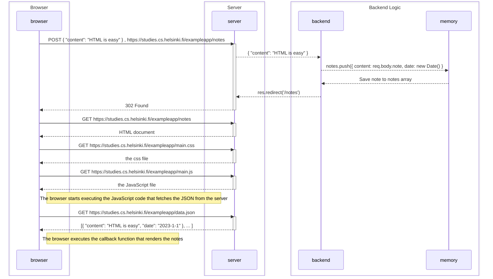

```mermaid
sequenceDiagram
    box Browser
    participant browser
    end

    box Server
    participant server
    end

    box Backend Logic
    participant backend
    participant memory
    end

    browser->> server: POST { "content": "HTML is easy" } , https://studies.cs.helsinki.fi/exampleapp/notes
    activate server
    server-->> backend: { "content": "HTML is easy" }

    backend-->> memory: notes.push({ content: req.body.note, date: new Date() }
    memory-->> backend: Save note to notes array

    backend-->> server: res.redirect('/notes')

    server-->> browser: 302 Found 
    deactivate server


    browser->>server: GET https://studies.cs.helsinki.fi/exampleapp/notes
    activate server
    server-->>browser: HTML document
    deactivate server

    browser->>server: GET https://studies.cs.helsinki.fi/exampleapp/main.css
    activate server
    server-->>browser: the css file
    deactivate server

    browser->>server: GET https://studies.cs.helsinki.fi/exampleapp/main.js
    activate server
    server-->>browser: the JavaScript file
    deactivate server

    Note right of browser: The browser starts executing the JavaScript code that fetches the JSON from the server

    browser->>server: GET https://studies.cs.helsinki.fi/exampleapp/data.json
    activate server
    server-->>browser: [{ "content": "HTML is easy", "date": "2023-1-1" }, ... ]
    deactivate server

    Note right of browser: The browser executes the callback function that renders the notes
```
