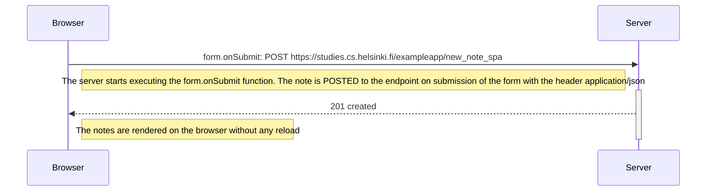

```mermaid
sequenceDiagram
    participant Browser
    participant Server

    Browser->> Server: form.onSubmit: POST https://studies.cs.helsinki.fi/exampleapp/new_note_spa
    Note right of Browser: The server starts executing the form.onSubmit function. The note is POSTED to the endpoint on submission of the form with the header application/json
    activate Server

    Server-->> Browser: 201 created
    Note right of Browser: The notes are rendered on the browser without any reload
    deactivate Server
    
```
